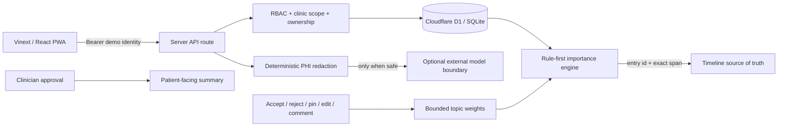

# Nightingale Care Note

A working, synthetic-data-only longitudinal care collaboration application. It turns fragmented consult notes into a single role-aware patient story with a sub-10-second Glance View, exact source traceability, collaboration, revision control, deterministic clinical safety floors, bounded importance learning, and a clinician-approved patient boundary.

Owner-only hosted demo: `https://nightingale-care-note-72hr.janki66.chatgpt.site`

Public source repository: `https://github.com/shirley830/nightingale-build-28082026`

> Prototype safety posture: this is not a medical device and is not for real PHI or clinical decisions. The demo identities and patient are synthetic.

## What is implemented

- Unified patient Care Note with Glance, timeline, role-owned plan sections, open tasks and conflicts.
- Distinct AI doctor, AI nurse and AI-patient entries (`author_role=system`) plus staff, clinician and system entries across April 2025, February 2026 and August 2026.
- Threaded internal comments, resolve/unresolve, `@mentions`, assignments and cross-tab refresh using `BroadcastChannel` plus 15-second polling.
- Full section snapshots, version increments, changes-since-version API, word-level diff UI, metadata-only audit and revert-as-new-version.
- Exact highlight provenance: `entry:<id>#span=<start>-<end>` resolves to the source entry and character span; a failed span fails closed.
- Role- and clinic-scoped API authorization for patient, staff, clinician and admin. UI hiding is never the authorization boundary.
- Deterministic importance floors for allergies, medications, dosages and unresolved tasks; operational evidence labels derived from source coverage and quality rather than model self-confidence.
- Accept/reject/pin/manual-highlight feedback with a bounded learned adjustment (`-6…+8`), no penalty for unseen items, and safety floors that learning cannot override.
- Conflict register for medication/dosage contradictions with clinician precedence only after confirmation; otherwise the conflict remains visible for review.
- Hybrid storage preview: hot/warm/cold tiers preserve allergies, medications, unresolved tasks and clinician-confirmed facts regardless of age. The prototype does not irreversibly delete source data.
- Deterministic PHI redaction for names, Singapore IDs/generic IDs and phones before the model boundary, with abstention when residual identifiers may remain.
- Higher-severity patient view: only clinician-approved summaries are returned; raw AI notes, drafts and internal comments are absent from the response.
- PWA shell and ambient transcript prototype with speaker, timestamps, confidence, redaction state and source pointer. It intentionally makes no external LLM call.

## Architecture



The application uses a capability-oriented single API route in `app/api/route.ts`. Every action authenticates a token to a fixed server-side identity, scopes the patient to that identity’s clinic, checks the allowed role, and checks immutable section ownership before querying or mutating D1. Conditional `UPDATE ... WHERE version=?` implements deterministic optimistic concurrency.

The complete relational model is in `db/schema.ts`; the executable initialization/seed path is in `db/store.ts`, and the generated migration is committed under `drizzle/`.

## Data relationships

```text
Clinic -> Users, Patients
Patient -> Entries -> Comments
Patient -> CareSections -> Versions, Comments
Patient -> Highlights -> Entry + exact character span (provenance)
Patient -> Tasks -> source Entry
Patient -> Conflicts -> prior Entry + new Entry
Patient -> PatientSummaries -> source Entry IDs + human approval
AI Entry -> source_id -> SourceSegments (timestamps, speaker, confidence)
HighlightFeedback(topic) -> bounded learned adjustment -> future Highlights
Every mutation -> AuditLog (actor/action/entity/version metadata; no note body)
```

## Technology

- Vinext/Next-compatible App Router, React 19, TypeScript and Tailwind CSS processing.
- Cloudflare Workers runtime with D1 (SQLite) and Drizzle schema/migrations.
- Python `pytest` + `requests` black-box HTTP tests.
- No model or external clinical API is called; the AI notes and transcript are synthetic fixtures.

## Setup

Prerequisites: Node.js `>=22.13`, pnpm 11, Python 3.11+.

```bash
pnpm install
python3 -m venv .venv
.venv/bin/pip install -r requirements-test.txt
pnpm dev
```

Open `http://localhost:3000`. The local D1 database and synthetic seed are created on first API request.

### Environment variables

No secret or API key is required. `NIGHTINGALE_BASE_URL` optionally changes the URL used by tests and the benchmark. Hosted D1 is injected as the `DB` binding declared in `.openai/hosting.json`.

For production, replace the fixed synthetic demo-token map in `lib/auth.ts` with the deployment identity-to-clinic/role directory. Do not enable public role switching or demo tokens with real data.

## Demo identities

The role switch uses opaque demo tokens which map server-side to fixed synthetic identities:

| UI identity | Role | Clinic | Token used by tests |
|---|---|---|---|
| Evelyn Lim | patient | clinic-1 | `demo-patient` |
| Maya Tan | staff | clinic-1 | `demo-staff` |
| Dr. Amelia Chen | clinician | clinic-1 | `demo-clinician` |
| Alex Koh | admin | clinic-1 | `demo-admin` |
| Jordan Lee | staff | clinic-2 | `demo-other-clinic` |

## Run and test

Keep `pnpm dev` running in one terminal:

```bash
.venv/bin/python -m pytest
.venv/bin/python scripts/benchmark_glance.py
pnpm build
```

Verified on 27 Aug 2026:

```text
13 passed in 0.47s
Production-compatible build: passed
Warm Glance benchmark: 200 requests after 10 warmups
P50 6.49 ms · P95 8.57 ms · max 20.71 ms · target ≤300 ms: met
```

The performance result is a local warm-path measurement against Vinext dev + local D1/Miniflare with sequential HTTP requests. It excludes WAN/TLS, cold starts and production concurrency, so it is evidence for the implementation path—not a production SLA claim. The raw recorded result is in `docs/PERFORMANCE_RESULTS.json`.

## RBAC enforcement

`lib/auth.ts` implements authentication, role checks, clinic scoping and section ownership checks. `app/api/route.ts` invokes them before every protected read and mutation.

- Patient responses contain only approved `patient_summaries`; direct access to comments or internal entries returns `403`.
- Staff can create `staff_note` and edit only `owner_role=staff` sections.
- Clinicians can create `clinician_note`, view all internal sources and edit only clinician-owned sections.
- Admin has clinic-scoped oversight; admin does not bypass clinic scoping.
- Cross-clinic queries fail as `404` to avoid confirming record existence.

## PHI redaction and model boundary

The redaction pipeline is `lib/redaction.ts`; the server endpoints are `action=redact` and `action=ambient`.

```text
capture -> deterministic regex redaction -> residual-risk check
        -> safe: eligible for approved model adapter
        -> uncertain: abstain (HTTP 422), no model call
```

It redacts labelled names/honorific names, Singapore NRIC-style identifiers, generic labelled IDs and Singapore phone numbers. Accuracy is explicitly evaluated: suspected remaining names or long digit runs cause abstention. Limitations include unlabelled/global names, novel ID formats and transcription errors; a production design should add locale-specific NER, character-error-aware matching and recall/precision monitoring on a labelled redaction set.

## Importance, evidence and abstention

`lib/importance.ts` decides importance before any generative prompt:

1. Deterministic category floors: allergy `94`, medication/dosage `88`, unresolved task `74`.
2. Add recency, rule-based risk, unresolved-task and clinician-confirmation signals.
3. Add the clinic/topic feedback value, bounded to `-6…+8`.
4. Clamp to the safety floor and 100.

The evidence score is `55% source coverage + 45% source quality`; `≥80 strong`, `≥60 moderate`, `≥40 limited`, `<40 abstain`. This is inspectable and testable. If wrong, the source span exposes the evidence, accept/reject captures correction, invalid spans fail closed, and critical rule floors remain.

Exposure-bias controls: unseen items receive zero—not negative—feedback; shown rejects have only a bounded negative effect. Fatigue controls: allergies/medications/dosages/tasks cannot fall below their rule floors. A production learner would require offline counterfactual evaluation and per-clinic minimum sample sizes before promotion.

## Patient-facing safety

AI drafts are stored as `draft`. Only a clinician can change a patient summary to `approved`. The patient API selects `status='approved'`; it never fetches raw AI notes or comments. Redaction uncertainty causes abstention rather than a guessed summary. The UI includes an emergency-care fallback and makes no autonomous medication instruction.

## Data decay

`decayTier()` classifies entries without deleting the immutable source:

- **Hot:** <90 days, score ≥70, protected clinical class, unresolved, or clinician-confirmed—retain full fidelity.
- **Warm:** <365 days or score ≥40—retain indexed summary plus source.
- **Cold:** older low-value information—candidate for body compression while preserving source pointer and reversible restore path.

Age alone never removes allergies, medication/dosage facts, unresolved tasks or clinician-confirmed risks. The prototype exposes a policy preview rather than performing irreversible compaction.

## Primary demo: Scenario B

Follow `docs/DEMO_SCRIPT.md`. The starting seed is restored by:

```bash
curl -X POST -H 'Authorization: Bearer demo-admin' -H 'content-type: application/json' -d '{}' 'http://localhost:3000/api?action=reset'
```

## Security assumptions and known limitations

- Synthetic data only; TLS and encryption at rest are supplied by the deployment platform, not reimplemented in application code.
- The fixed demo tokens are deliberately not production authentication. Production requires an identity directory and explicit clinic/role assignments behind SIWC/workspace authentication.
- D1 local initialization is convenient for evaluation; production uses reviewed migrations and least-privilege deployment bindings.
- Cross-tab updates are near-real-time (BroadcastChannel + polling), not a durable websocket presence service.
- Ambient capture accepts a transcript and demonstrates the privacy/provenance pipeline; it does not perform real ASR, diarization, overlap handling or multilingual terminology normalization.
- The PWA shell caches only non-API assets. Protected API responses are `private, no-store` and are never placed in the service-worker cache.
- This is a candidate prototype, not validated medical software. Clinical safety rules require governance, monitoring and prospective evaluation before real use.

## Repository map

```text
app/                  UI and server API
db/                   schema, D1 initialization, synthetic seed
drizzle/              generated SQL migration
lib/                  auth, importance, redaction, shared types
tests/                required and additional black-box micro-tests
scripts/              warm-path benchmark
docs/                 demo, performance, requirement matrix
Technical-Brief.docx  2–3 page submission brief
ATTRIBUTION.txt        dependency/model/API licenses
```
